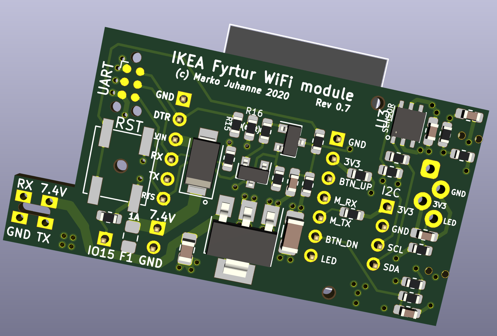
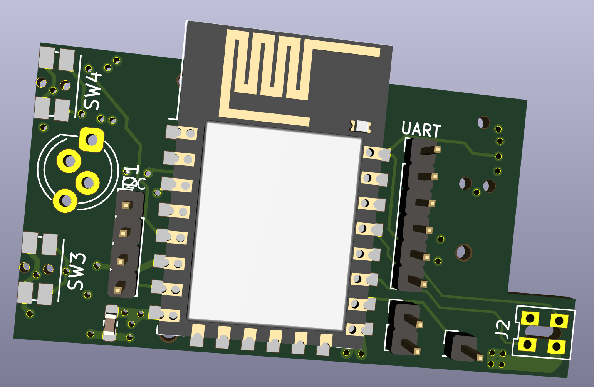

# ikea-fyrtur

## Introduction

This is a ESP8266 WiFi module PCB to be used with Ikea Fyrtur or Kadrilj roller blinds. It substitutes the original Ikea Trådfri (Zigbee) based board.

#### Enhancements:
 - Easier and more stable connectivity with non-Ikea home automation systems (such as Home Assistant) without additional hardware hub (please see [esp-fyrtur repository](https://github.com/mjuhanne/fyrtur-esp) for the software)
 - Designed to be powered with wired 5-7.5V DC power adapter, so no more charging the battery every few months! (5V charger can be used only when a custom fyrtur motor firmware is used. For this, see [fyrtur-motor-board repository](https://github.com/mjuhanne/fyrtur-motor-board))
 - On-board 1A fuse for extra safety
 - Additional connection header allows the use of other platforms (such as ESP32 or Arduino) since now the battery compartment is empty and can hold larger wireless modules
 - Optional I2C Temperature and humidity sensor (Si7021 or HTU21D)
 - Optional Neopixel RGB-led to be used as a status LED

## Assembly
 
Ready Gerber and BOM/component position files for PCB production and SMT assembly for JLCPCB.com
 - The tiny motor connector PCB should be desoldered from the original board and re-used.
 - The only self-sourced components are the ESP12F module, temperature sensor and fuse (The buttons and LED can be ordered or alternatively scavenged from the original board)

## Programming

Programming can be done via the 2mm pitch UART header using FTDI adapter. Alternatively a special [TagConnect](https://www.tag-connect.com/product/tc2030-nl-ftdi-ttl-232r-usb-to-tc2030-no-legs-serial-cable) adapter can be used if you don't want to solder the UART header (not tested yet).

## Interface board

 The PCB can also be used as a plain interface board (with buttons and LED populated, with optional temperature sensor). In this case only the following components are needed:
 
#### Connector header:
  - J1 EXT_CTRL (1x7, 2mm pitch) (or solder female Dupont wires directly to the header)

#### Buttons and debounce circuitry:
 - Panasonic right angle tactile switches (EVQ-P7L01P)
 - R11,R12 (10K)
 - R9 (120R), R10 (10K)
 - C6, C7 (100nF)

#### LED:
 - any 3.5mm diameter LED
 - R13 (270R - 1K, depending on the LED forward voltage drop and desired brightness)

#### Temperature sensor components:
 - U3 (SI7021 / HTU21D)
 - R6, R4 (10k)
 - C5 (100nF)
 - J6 I2C header (1x4, 2mm pitch) (or solder female Dupont wires directly to the header)

### Example wiring for ESP32 (DevKitC V4)
  - J1:1 <--> GND
  - J1:2 <--> 3V3
  - J1:3 <--> D21 (BTN_UP)
  - J1:4 <--> D5 (Motor UART RX)
  - J1:5 <--> D23 (Motor UART TX)
  - J1:6 <--> D22 (BTN_DOWN)
  - J1:7 <--> D18 (LED)
 
#### Optional I2C temperature sensor:
  - J6:3 <--> D19 (SCL)
  - J6:4 <--> D13 (SDA)
 

